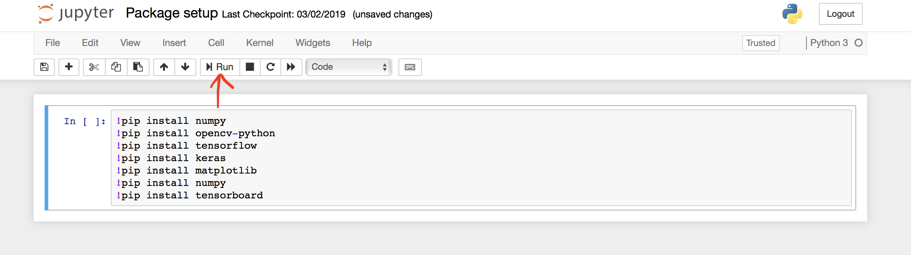

## Anaconda IDE installation

**Installing on Windows** : https://docs.anaconda.com/anaconda/install/windows/ <br>
**Installing on macOS** : https://docs.anaconda.com/anaconda/install/mac-os/ <br>
**Installing on Linux** : https://docs.anaconda.com/anaconda/install/linux/ <br>

<p>Note: Choose Python 3.7 Graphical version from the versions available. It is not required to install PyCharm along with Anaconda IDE.<br>After your installation is complete, verify it by opening Anaconda Navigator from your terminal/desktop. You should be able to see something like this.</p>


<p>Now, click on the option to 'Launch' Jupyter notebook. This will take you to a directory where you can work with your python scripts.</p>


## Installing required Packages

<p>Create a new Python 3 notebook. Copy and paste the following commands in a new cell. Tensorflow and keras will be required for model building. Matplotlib and tensorboard for visualisations. Click on the 'Run' 'icon to run the cell.</p>

```sh
!pip install numpy
!pip install opencv-python
!pip install tensorflow
!pip install keras
!pip install matplotlib
!pip install tensorboard
```


## Downloading the dataset

<p> We will be working with classic Dog vs Cat classification and we will be using the Kaggle dataset for the same. The following link will direct you to the kaggle page. <br></p>

https://www.kaggle.com/c/dogs-vs-cats/data<br>uj

<p>Before downloading the data, you will have to sign in with your Google account. Then click on 'Download All' at the bottom of the page.</p>


<p>Unzip the downloaded file. The contents of the file will be as follows</p>


<p>Once your installations are ready and the data is downloaded, you are good to go!</p>


